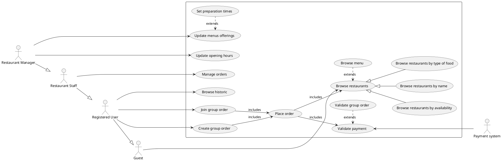
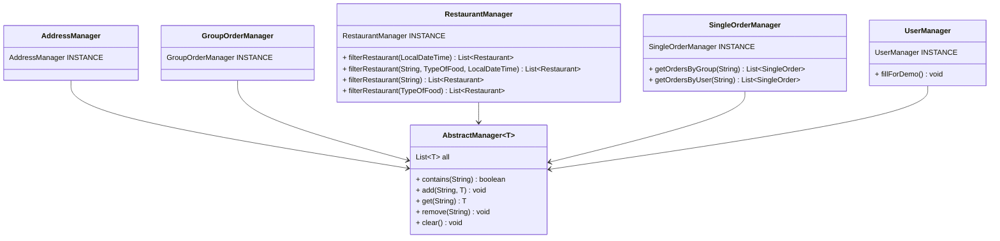
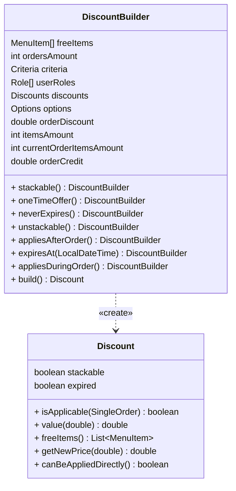
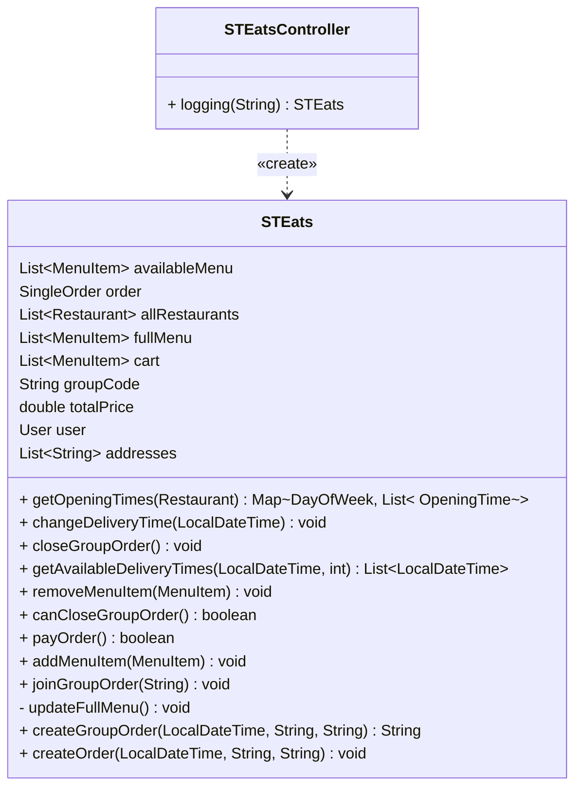
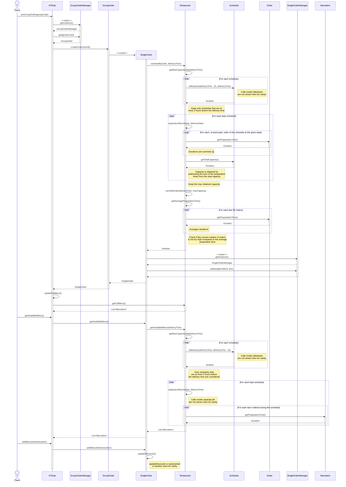
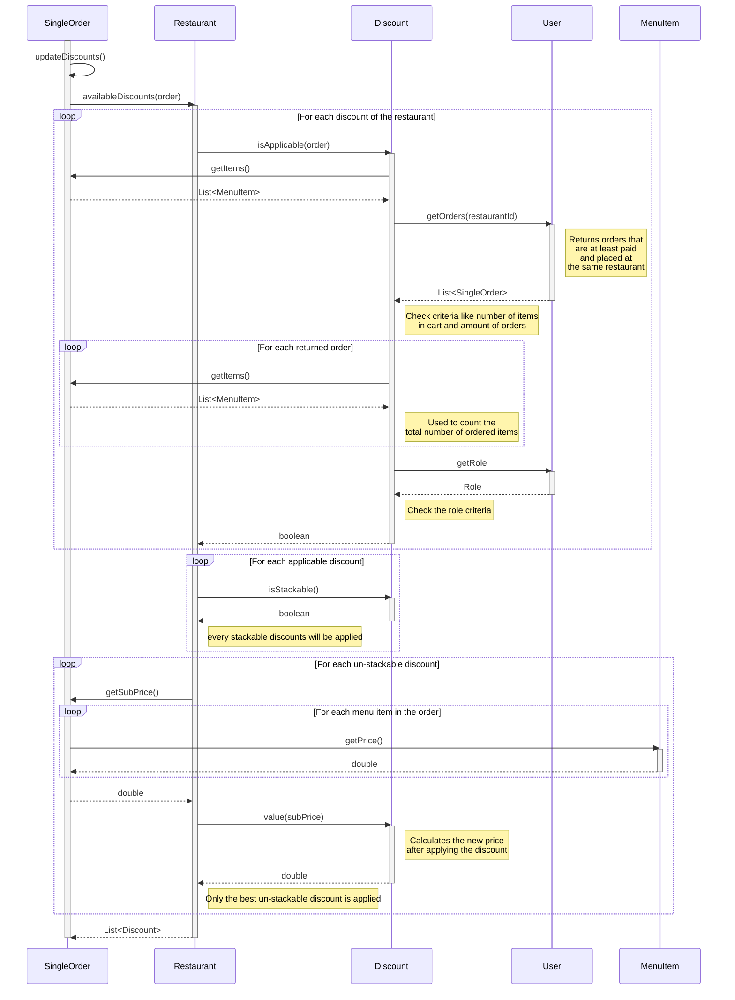

## Team Members and Roles

* LASSAUNIÈRE Théo (PO)
* FALCOZ Alban (SA)
* GALLI Evan (QA)
* GRIPARI Alexandre (Ops)

## Functional scope

### Hypothesis

* Orders within a group order can only be placed at the same restaurant
* The delivery time of a group order or a single order doesn't need to be specified in advance, in this case the system will propose a appropriate delivery time (one that
  satisfies the restaurant capacity).

### Found limits

* We try to prepare the menu item during the schedule (30 min for example) before the delivery time. If the item can't be prepared because the schedule is too tight, we
  try to prepare it during the previous schedule, up until 2 hours before. If it can't be prepared during any of the schedules 2 hours before then the item is not
  available.
* As we don't have a database for this project, we had to create managers to handle our data. We have managers to add, remove, retrieve restaurants, users, addresses,
  single orders and group orders that have already been created. These managers allow us to simulate our database.

### Selected strategies and specific elements

#### Extensions 1 : Discount

The discount system consists of the `DiscountBuilder` and `Discount` classes.
The `DiscountBuilder` class uses the builder pattern to construct `Discount` objects with various options, criteria, and discount details. We've chosen this pattern
because it allows flexible and readable construction of discounts by chaining method calls.
The `Discount` class encapsulates all the discount logic. We've chosen to have just one `Discount` class to enable the criteria/effects of the same discount to be
combined (for example, we could imagine offering a free product and a 50c discount to every student ordering at least 10 items).
But the `Discount` class may become cumbersome if too many criteria or discount effects are added, a potential evolution would be to implement a chain of responsibility
pattern.

#### Extensions 2 : Restaurant overload control

In order to not invalidate orders and to not take into account orders that may never be validated, we have decided to set a maximum number of (non-validated) orders
possible at the same time.
This maximum is calculated as follows:

$$
\frac{\text{Remaining time}}{\text{Average order time}}
$$

Note:

* The average order time is calculated from an arbitrary number of past orders (currently set at 50).
* The number of non-validated orders is strictly lower to the maximum to give a margin.

## UML conception

### Glossary

* **Guest :** A person browsing the platform without being authenticated
* **Registered User :** Any registered member of the campus (students, staff, ...)
* **Restaurant Staff :** A person employed by the restaurant to prepare meal
* **Restaurant Manager :** A restaurant staff that can update menus offering and opening hours

---

* **Menu:** All the menu items propose by a restaurant
* **MenuItem:** A item propose by a restaurant (ex : ice-cream, fries, burger, soda, ...)

### Use case diagram

### Class diagram

```mermaid
classDiagram
  direction BT

  namespace order {
    class Address {
      + label() String
      + street() String
      + additional_address() String
      + postal_code() String
      + city() String
    }
    class AddressManager {
      AddressManager INSTANCE
    }
    class GroupOrder {
      + closeOrder() void
      + pay(SingleOrder) boolean
      + getAvailableDeliveryTimes(LocalDateTime, int) List~LocalDateTime~
      + createOrder(String) SingleOrder
      List~MenuItem~ availableMenu
      List~SingleOrder~ orders
      Address address
      String restaurantId
      LocalDateTime orderTime
      double price
      List~User~ users
      Restaurant restaurant
      Duration preparationTime
      String groupCode
      LocalDateTime deliveryTime
      List~MenuItem~ items
      Status status
    }
    class GroupOrderManager {
      GroupOrderManager INSTANCE
    }
    class Order {
      <<Interface>>
      LocalDateTime orderTime
      List~MenuItem~ availableMenu
      List~User~ users
      Restaurant restaurant
      Duration preparationTime
      String groupCode
      Address address
      LocalDateTime deliveryTime
      String restaurantId
      List~MenuItem~ items
      Status status
    }

    class Saleable {
      <<Interface>>
      double price
    }

    class SingleOrder {
      + addMenuItem(MenuItem) void
      + removeMenuItem(MenuItem) void
      + pay() boolean
      - updateDiscounts() void
      Optional~GroupOrder~ groupOrder
      List~MenuItem~ availableMenu
      double subPrice
      List~Discount~ discounts
      Address address
      String restaurantId
      String id
      User user
      LocalDateTime orderTime
      double price
      List~User~ users
      Restaurant restaurant
      Duration preparationTime
      List~Discount~ discountsToApplyNext
      String groupCode
      LocalDateTime deliveryTime
      List~MenuItem~ items
      Payment payment
      Status status
      String userId
    }
    class SingleOrderManager {
      + getOrdersByUser(String) List~SingleOrder~
      + getOrdersByGroup(String) List~SingleOrder~
      SingleOrderManager INSTANCE
    }
    class Status {
      <<enumeration>>
      + values() Status[]
      + valueOf(String) Status
    }
  }

  namespace discounts {
    class Discount {
      + isApplicable(SingleOrder) boolean
      + value(double) double
      + freeItems() List~MenuItem~
      + getNewPrice(double) double
      + canBeAppliedDirectly() boolean
      boolean stackable
      boolean expired
    }
    class DiscountBuilder {
      + stackable() DiscountBuilder
      + oneTimeOffer() DiscountBuilder
      + neverExpires() DiscountBuilder
      + unstackable() DiscountBuilder
      + appliesAfterOrder() DiscountBuilder
      + expiresAt(LocalDateTime) DiscountBuilder
      + appliesDuringOrder() DiscountBuilder
      + build() Discount
      MenuItem[] freeItems
      int ordersAmount
      Criteria criteria
      Role[] userRoles
      Discounts discounts
      Options options
      double orderDiscount
      int itemsAmount
      int currentOrderItemsAmount
      double orderCredit
    }
  }
  namespace restaurant {
    class MenuItem {
      + toString() String
      + equals(Object) boolean
      + hashCode() int
      String name
      Restaurant restaurant
      Duration preparationTime
      String restaurantName
      double price
    }
    class OpeningTime {
      + toString() String
      + hashCode() int
      + equals(Object) boolean
      LocalTime end
      LocalTime start
    }

    class Schedule {
      + overlap(Schedule) boolean
      + compareTo(LocalDateTime) int
      + isBetween(LocalDateTime, LocalDateTime) boolean
      + contains(LocalDateTime) boolean
      + hashCode() int
      + toString() String
      + equals(Object) boolean
      + contains(Order) boolean
      + compareTo(Schedule) int
      Duration totalCapacity
      int nbPerson
      Duration duration
      LocalTime end
      DayOfWeek dayOfWeek
      LocalTime start
    }
    class Restaurant {
      - getMaxCapacityLeft(LocalDateTime) Duration
      + hashCode() int
      + addSchedule(Schedule) void
      + removeDiscount(Discount) void
      + addOrder(Order) void
      + addMenuItem(MenuItem) void
      + discounts() List~Discount~
      - capacityLeft(Schedule, LocalDateTime) Duration
      + toString() String
      - canAddOrder(LocalDateTime, Duration) boolean
      + getOpeningTimes(DayOfWeek) List~OpeningTime~
      + getAvailableMenu(LocalDateTime) List~MenuItem~
      + equals(Object) boolean
      + addScheduleForPeriod(int, DayOfWeek, LocalTime, DayOfWeek, LocalTime) void
      + availableDiscounts(SingleOrder) List~Discount~
      + canHandle(Order, LocalDateTime) boolean
      + canDeliverAt(LocalDateTime) boolean
      + addDiscount(Discount) void
      + removeMenuItem(MenuItem) void
      String name
      TypeOfFood typeOfFood
      List~Order~ orders
      List~MenuItem~ fullMenu
      Duration averagePreparationTime
      Duration scheduleDuration
    }
    class RestaurantManager {
      + filterRestaurant(LocalDateTime) List~Restaurant~
      + filterRestaurant(String) List~Restaurant~
      + filterRestaurant(String, TypeOfFood, LocalDateTime) List~Restaurant~
      + filterRestaurant(TypeOfFood) List~Restaurant~
      RestaurantManager INSTANCE
    }
    class TypeOfFood {
      <<enumeration>>
      + values() TypeOfFood[]
      + valueOf(String) TypeOfFood
    }
  }
  namespace payment {
    class Payment {
      + date() LocalDateTime
      + amount() Double
    }
    class PaymentSystem {
      + pay(double) Optional~Payment~
    }
  }
  namespace user {
    class Role {
      <<enumeration>>
      + valueOf(String) Role
      + values() Role[]
    }
    class User {
      + getOrders(String) List~SingleOrder~
      + getDiscountsToApplyNext(String) List~Discount~
      String name
      List~SingleOrder~ orders
      Role role
      List~Payment~ payments
      String userId
    }
    class UserManager {
      + fillForDemo() void
      UserManager INSTANCE
    }
  }

  class AbstractManager~T~ {
    + clear() void
    + add(String, T) void
    + contains(String) boolean
    + remove(String) void
    + get(String) T
    List~T~ all
  }
  class NotFoundException
  class STEats {
    + getOpeningTimes(Restaurant) Map~DayOfWeek, List~ OpeningTime~~
    + changeDeliveryTime(LocalDateTime) void
    + closeGroupOrder() void
    + getAvailableDeliveryTimes(LocalDateTime, int) List~LocalDateTime~
    + removeMenuItem(MenuItem) void
    + canCloseGroupOrder() boolean
    + payOrder() boolean
    + addMenuItem(MenuItem) void
    + joinGroupOrder(String) void
    - updateFullMenu() void
    + createGroupOrder(LocalDateTime, String, String) String
    + createOrder(LocalDateTime, String, String) void
    List~MenuItem~ availableMenu
    SingleOrder order
    List~Restaurant~ allRestaurants
    List~MenuItem~ fullMenu
    List~MenuItem~ cart
    String groupCode
    double totalPrice
    User user
    List~String~ addresses
  }
  class STEatsController {
    + logging(String) STEats
  }

  AbstractManager~T~ ..> NotFoundException: «create»
  AddressManager --> AbstractManager~T~
  DiscountBuilder ..> Discount: «create»
  GroupOrder ..> Order
  GroupOrder ..> SingleOrder: «create»
  GroupOrder "1" *--> "status 1" Status
  GroupOrderManager --> AbstractManager~T~
  MenuItem ..> Saleable
  Order --> Saleable
  PaymentSystem ..> Payment: «create»
  Restaurant "1" *--> "discounts *" Discount
  Restaurant "1" *--> "menu *" MenuItem
  Restaurant ..> OpeningTime: «create»
  Restaurant "1" *--> "orders *" Order
  Restaurant ..> Schedule: «create»
  Restaurant "1" *--> "schedules *" Schedule
  Restaurant "1" *--> "typeOfFood 1" TypeOfFood
  RestaurantManager --> AbstractManager~T~
  STEats ..> GroupOrder: «create»
  STEats "1" *--> "fullMenu *" MenuItem
  STEats "1" *--> "order 1" SingleOrder
  STEats ..> SingleOrder: «create»
  STEats "1" *--> "user 1" User
  STEatsController ..> STEats: «create»
  SingleOrder "1" *--> "appliedDiscounts *" Discount
  SingleOrder "1" *--> "items *" MenuItem
  SingleOrder ..> Order
  SingleOrder "1" *--> "payment 1" Payment
  SingleOrder "1" *--> "status 1" Status
  SingleOrderManager --> AbstractManager~T~
  User "1" *--> "role 1" Role
  UserManager --> AbstractManager~T~
  UserManager ..> User: «create»
```

### Design patterns

#### Design patterns we included

##### Singleton

For our project, we didn't have a database. However, for our code and our tests, we still needed to access, modify or check the existence of our data, for example to
create an order.
That's why we simulated our database using our managers. We have an AbstractManager abstract class, which has the contains, add, get, remove and clear methods. For all
our classes that need to be represented in our database, we've created a manager class that inherits from AbstractManager.
To ensure that we only have a single instance of these classes, as in a real database, while sharing the data between the different classes that will use our managers, we
decided to transform these classes into singletons

##### Builder

To implement the extension of discount strategies for restaurants, we decided to use the Builder design pattern.
We created two classes: Discount and DiscountBuilder.
Our DiscountBuilder has options (is the discount cumulative, does it apply to the current order or the next one, etc.), criteria (the number of items required to trigger
the discount, what the user's role should be, etc.) and certain types of discount (free items, reduce the total price of the order by a certain percentage/amount, etc.).
Once the options, criteria and types of discount have been chosen, all that remains is to build the discount using the discount builder.
Restaurants have a list of discounts to apply to each order, and single orders have a list of applied discounts that is updated with each new item added to the cart.

##### Facade

We choose to implement a Facade design pattern to serve as a primary entry point for our backend, particularly in managing user interactions and coordinating requests.
It hides the complexity of the subsystem by providing a higher-level interface, making it easier to manage and coordinate the interactions between the different
components of the subsystem.

#### Design patterns we almost included

##### Proxy

We wanted to implement a proxy, so that we could restrict orders to registered users, the taking of an order to restaurant staff, and changes to opening times to
restaurant managers.
However, we didn't do it due to lack of time and because it's possible that we'd implement it during the creation of the front-end.

##### Chain of Responsibility

Initially, we wanted to manage the criteria for discounts using a chain of responsibility. We wanted each criterion to be checked by a class, and the discount to move
from class to each class to validate/invalidate each criterion.
However, this would result in a lot of fairly empty classes, since they would only be used to check a single pretty simple criterion.

### Sequence diagram

> Individual order inside a group order

> Discounts

### Mock-up

## Code quality and project management

### Supported test types, quality and coverage

We have unitary tests assuring that methods containing a complex algorithm works properly and also functional tests through the use of US (User Story), which translates
into Gherkin scenarios.

We also have some integration testing through the facade, which is responsible for distributing responsibilities across the classes.

This results in a 90% coverage on methods, which gives us a certain confidence in the quality and reliability of the code.

### Our vision of code quality

Our vision of code quality revolves around building a structured, maintainable, and resilient codebase with careful attention to package organization and component
responsibility. Each package is designed to encapsulate specific functionality, promoting cohesion and reducing dependencies. This approach allows us to assign clear
responsibilities across the codebase, though we recognize that some areas, such as a the facade class `STEats`, currently take on a bit too much. As a result, this
component has become overly complex, handling tasks beyond its intended purpose and tends to become a *"God"* class. Moving forward, we aim to refactor this facade into
more focused modules, distributing responsibilities more effectively and enhancing code readability.

In terms of error handling, our strategy has prioritized capturing and managing straightforward, anticipated errors, which has contributed to stable performance in
standard scenarios. However, we acknowledge that more tests should be done on rare errors or edge-cases,
such as the non validation of a group order or validating a group order just before the delivery time.
Addressing these edge cases more rigorously will help strengthen our application’s reliability in diverse environments.

### Our project management

To bring business value to our project, we first create a US (User story) from this user story, we then create technical issues. Each user story is linked to one or more
issue(s) that aim to respond to it.
To be able to work in parallel, each member creates a branch from main, named feature/name, and indicates which issue(s) will be closed.
On each pull request on main, thanks to GitHub Actions, it automatically executes the compilation and all tests.

## Retrospective and self-assessment

### What was done well, lessons learned, mistakes made

In this project, several key practices were implemented successfully, including effective package separation that ensured modularity, comprehensive test coverage, and
well-organized GitHub repositories that streamlined collaboration and tracking.
Through this experience, we also deepened our understanding of design patterns, recognizing their importance for sustainable and maintainable code architecture.
Additionally, we learned the critical role of well-defined user stories in maximizing business value and gained insights into using scenario tests to simulate real-world
functionality.
However, there were areas for improvement: one significant oversight was creating a facade layer that took on excessive responsibilities, complicating its
maintainability.
Some tests also relied on time-dependent data, which introduced inconsistencies and made results harder to predict.

### PO (Lassaunière Théo)

As the product owner of STEats, my role was to link the users needs to the implemented feature in our projects. I had to ensure each feature implemented was linked to a
certain user need.
In order to fulfil my assignment, I had to put myself in the user's shoes. For this, I wrote user stories in order to guide the features development. Each user story had
to be defined by a scenario, a level of priority, a business rule (how we implement the requested feature as devs) and acceptances criterias (scenario for tests).
In total, we came up with 6 different user stories covering all the features to be implemented in our project. I tried to make sure we implemented the stories with the
highest priority first, in case we didn't have time to do them all.

### SA (Falcoz Alban)

In my role as Software Architect, I ensured the quality of the project structure.
To do this, I had a lot of discussions with the other members to find the best way of dividing the project into different classes. That's how I came up with the skeleton
of each class, asking myself what its responsibilities should be, what methods and arguments it should have, and so on.
However, although we tried to produce the best possible architecture, we unfortunately came up against problems that we hadn't seen coming. And to solve some of these
problems, we needed to refactor some functionality in our architecture. However, I tried to avoid these refactors as much as possible, by thinking about how to solve the
problem without completely changing certain classes.

### QA (Galli Evan)

As a Quality Assurance (QA) engineer, I was responsible for ensuring the overall quality and reliability of the application.
I did all the code reviews before merging branches, to make sure everything was up to a certain standard and to find logical issues with the proposed code. I collaborated
closely with the rest of the team to understand the implementation details and provided feedback on potential defects.
I also designed and executed comprehensive test plans to cover all functional and non-functional requirements. I utilized JUnit and Cucumber for automated testing,
ensuring that all features were thoroughly tested through unit tests, integration tests, and behavior-driven development (BDD) scenarios.

### Ops (Gripari Alexandre)

In this project, I fulfilled my operational mission by implementing a seamless workflow through strategic use of Git branch management and continuous integration. I set
up a robust branching strategy to isolate features and the main code, which allowed our team to work concurrently while maintaining code integrity.
Through automated CI pipelines (automated build and test run for every PR on main), I ensured that each code update was thoroughly tested, helping us catch issues early
and maintain high-quality standards across development cycles.
Finally, each pull request had to be reviewed by 2 members before being validated and then merged. By orchestrating these operational processes, I contributed to a
smoother, faster development lifecycle and supported the team in delivering reliable results on time.

### Self-assessment

Everyone fulfilled the various tasks attributed to their roles and contributed to the development of the backend.

|   Name    | Grade |
|:---------:|:-----:|
|   Alban   |  100  |
|   Théo    |  100  |
|   Evan    |  100  |
| Alexandre |  100  | 
