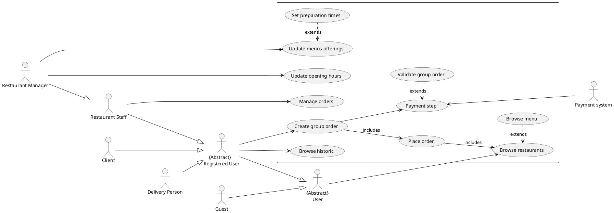
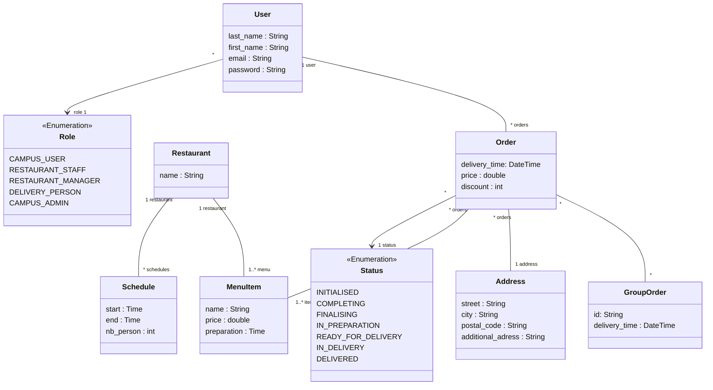

# Glossary

## Actors

User : Person that uses our system  
Guest : Unregistered User  
Client : Registered User that is not working as restaurant Staff nor delivery person  
Restaurant Staff : A person employed by the restaurant to prepare meal  
Restaurant Manager : A restaurant staff that can update menus offering and opening hours  
Delivery Person : Person in charge of the delivery of the meal  
Administrators : Person that have control over restaurant partnerships and delivery services.

# Use-Case Diagram

# Class Diagram

