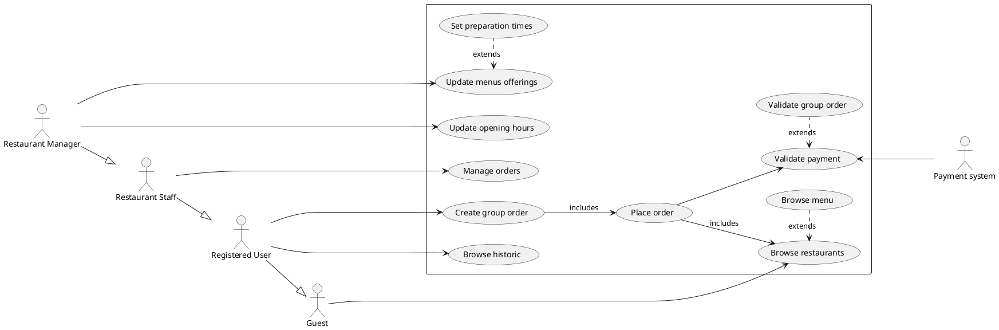
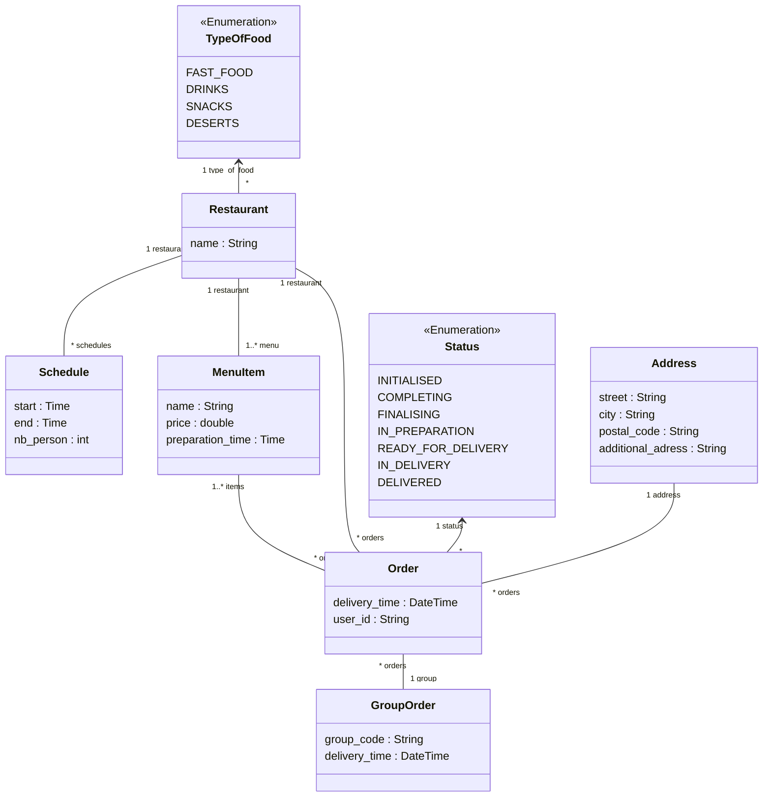
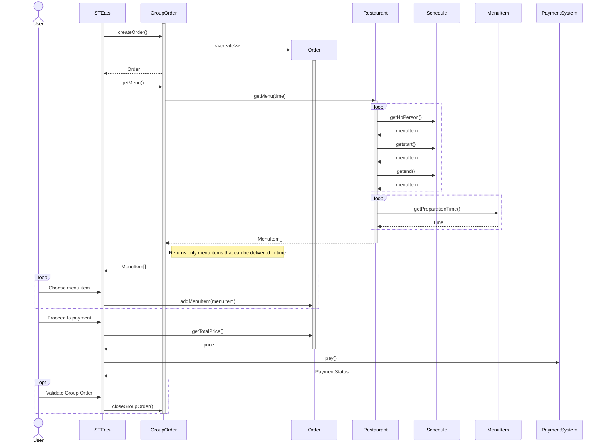
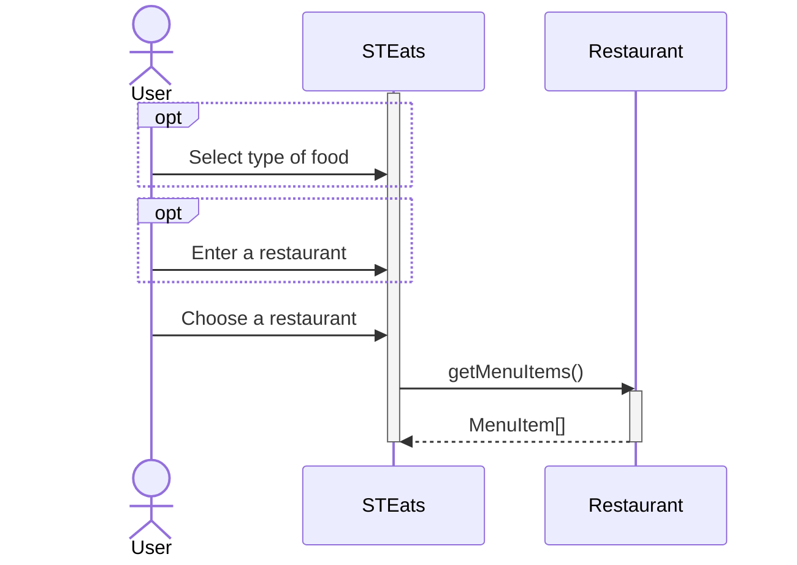

# Glossary

## Actors

**User :** Person that uses our system  
**Guest :** Unregistered User  
**Client :** Registered User that is not working as restaurant Staff nor delivery person  
**Restaurant Staff :** A person employed by the restaurant to prepare meal  
**Restaurant Manager :** A restaurant staff that can update menus offering and opening hours  
**Delivery Person :** Person in charge of the delivery of the meal  
**Administrators :** Person that have control over restaurant partnerships and delivery services.

# Use-Case Diagram

# Class Diagram

# Sequence Diagram

## Group order

## Search for a meal

