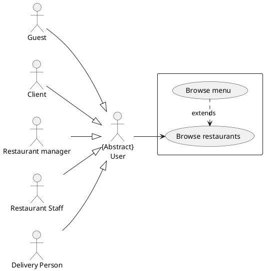
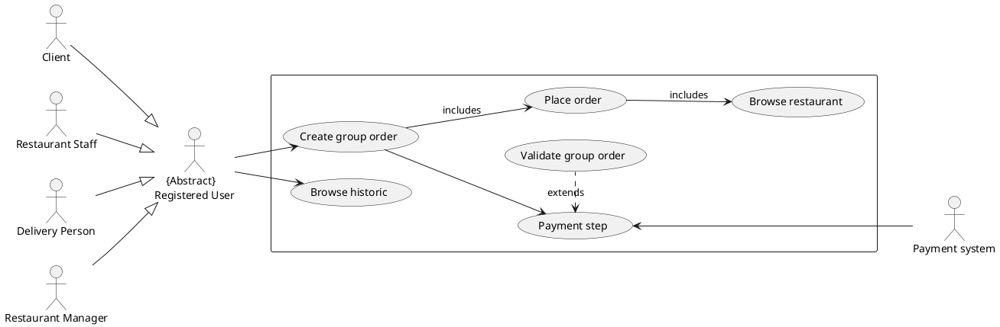
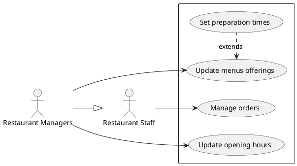
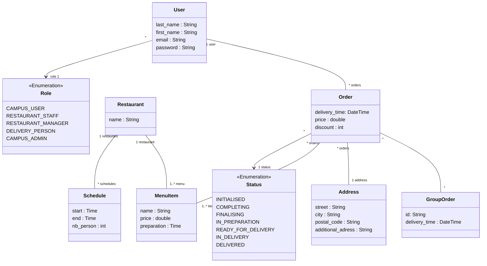

# Glossary

## Actors

User : Person that uses our system 
Guest : Unregistered User
Client : Registered User that is not working as restaurant Staff nor delivery person
Restaurant Staff : A person employed by the restaurant to prepare meal
Restaurant Manager : A restaurant staff that can update menus offering and opening hours
Delivery Person : Person in charge of the delivery of the meal
Administrators : Person that have control over restaurant partnerships and delivery services.

# Use-Case Diagram

## Browse restaurants or menus

## Order and track 

## Manage store

# Class Diagram

