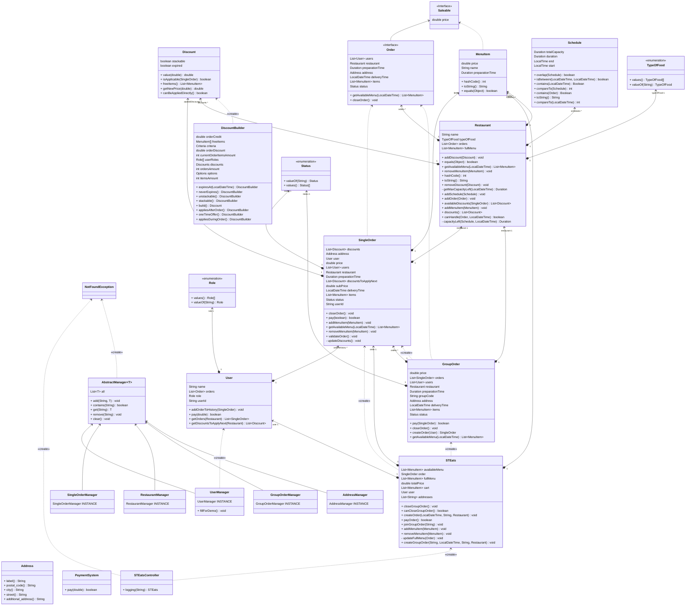

# Group members

* **Falcoz** Alban (SA)
* **Galli** Evan (QA)
* **Gripari** Alexandre (Ops)
* **Lassauniere** Theo (PO)

# Hypothesis and limits found

* Orders within a group order can only be placed at the same restaurant
* We try to prepare the menu item during the schedule (30 min for example) before the delivery time. If the item can't be prepared because the schedule is too tight, we try to prepare it during the previous schedule, up until 2 hours before. If it can't be prepared during any of the schedules 2 hours before then the item is not available.

# Glossary

* **Guest :** A person browsing the platform without being authenticated
* **Registered User :** Any registered member of the campus (students, staff, ...)
* **Restaurant Staff :** A person employed by the restaurant to prepare meal
* **Restaurant Manager :** A restaurant staff that can update menus offering and opening hours

---

* **Menu:** All the menu items propose by a restaurant
* **MenuItem:** A item propose by a restaurant (ex : ice-cream, fries, burger, soda, ...) 

# Use-Case Diagram

# Class Diagram

# Sequence Diagram

## Individual order inside a group order

## Search for a meal

# Mockup

